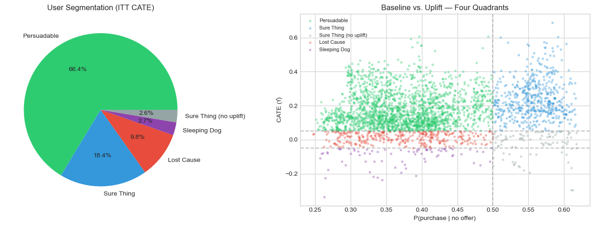
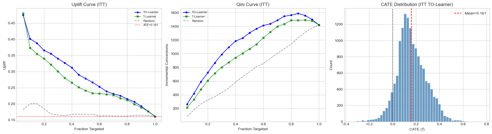
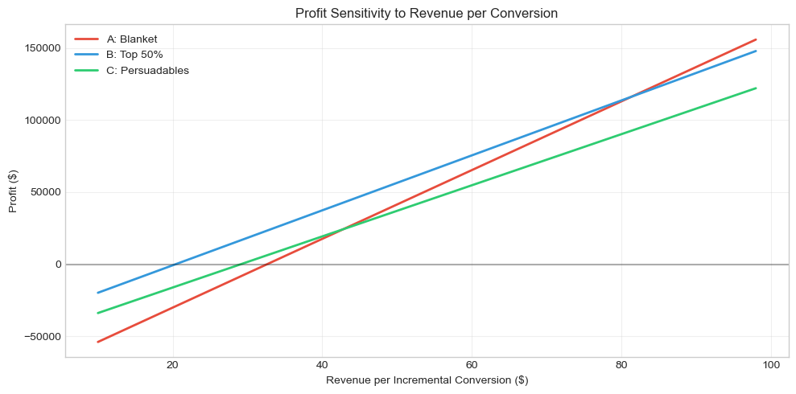
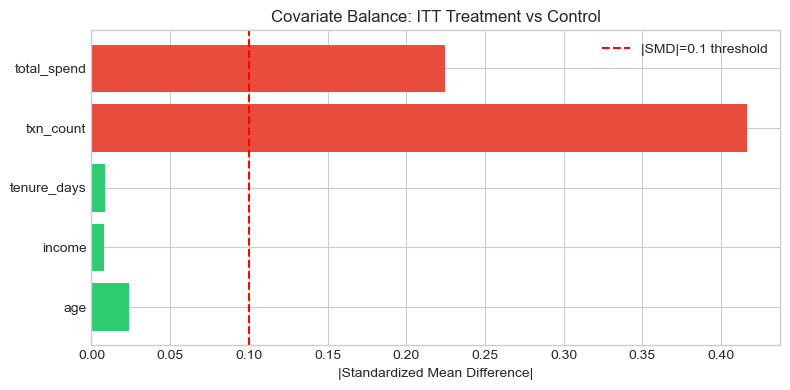

<h1 align="center">☕ Marketing Targeting Optimization (Causal Uplift Modeling)</h1>
<h3 align="center">From Who Gets an Offer → To Who Should Get an Offer</h3>

<p align="center">
  
  
  
  
</p>

---

## 🚀 Business Impact (TL;DR)

- Reduced marketing cost by **~33.6%** by targeting only high-impact users
- Identified that **~49% of observed lift** was driven by selection bias
- Upgraded targeting strategy from average lift to **individual causal uplift**
- Reached positive ROI under realistic CLV assumptions

👉 Instead of sending offers to everyone, we target users who are likely to be influenced.

---

## 🎯 Problem & Solution

**Problem**  
Marketing campaigns often send offers broadly, wasting budget on users who would purchase anyway.

👉 The business question is: **Who should we target to maximize ROI?**

**Solution**  
Built a causal uplift framework to estimate true incremental impact:

- Identified users influenced by promotions (`Persuadables`)
- Corrected selection bias with causal inference methods
- Compared targeting strategies using profit and ROI

**Result**  
Targeting only high-impact users can reduce cost by ~33% while maintaining incremental revenue.

---

## 📊 Key Results

### Key Insight

- Naive observed lift: **+28.4 pp**
- Bias-corrected causal uplift: **~15–16 pp**
- **~49%** of naive lift was selection bias

👉 Naive targeting overestimates campaign effectiveness.

### Business Decision

- ❌ Do not target all users uniformly
- ✅ Target top-uplift segments only
- 💰 Reduce cost by ~33.6% with minimal revenue trade-off

👉 Focus on **incremental impact**, not total conversion.

---

## 💡 Business Recommendation

- Target `Persuadable` users first (high positive uplift)
- Avoid over-targeting `Sure Things` (already likely to buy)
- Never target `Sleeping Dogs` (negative treatment effect)

Use causal uplift, not average treatment effect alone, for production targeting.

---

## 🔍 Technical Validation Snapshot

| Metric | Observational (Naive) | Observational + IPW | **ITT (Clean Causal)** |
|:-------|:---------------------:|:-------------------:|:----------------------:|
| Treatment definition | Viewed offer | Viewed offer | **Received offer** |
| ATE estimate | 0.284 ❌ inflated | 0.144 ✅ corrected | **0.161 ✅ benchmark** |
| Selection bias | ~49% of estimate | Corrected | N/A (randomized) |
| SRM check | Not applicable | Not applicable | ✅ Pass (p=0.26) |

---

### ROI Comparison: Targeting Strategies

| Strategy | Users Targeted | Cost | Incremental Revenue | Profit | ROI |
|:---------|:--------------:|:----:|:-------------------:|:------:|:---:|
| A: Blanket (all users) | 14,825 | $36,786 | $47,755 | −$3,683 | −10.0% |
| **B: Top 50% by CATE** | **7,412** | **$18,393** | **$28,103** | **−$885** | **−4.8%** |
| C: Persuadables only | 9,839 | $24,420 | $36,602 | −$2,054 | −8.4% |
| D: Exclude Sleeping Dogs | 14,419 | $35,779 | $48,810 | −$1,617 | −4.5% |

> 💡 At $20/conversion (single-transaction view), strategies are marginally negative. **Strategy B breaks even at $20.41/conversion** — far below Starbucks-like CLV assumptions, making uplift targeting economically robust in practice.

---

## 🎨 Visualizations

### Four-Quadrant User Segmentation (ITT)

<p align="center">
  
</p>

| Segment | % of Users | Avg CATE | Strategy |
|:--------|:----------:|:--------:|:---------|
| 🟢 **Persuadable** | 66.4% | +0.18 | ✅ Send offers — they need the nudge |
| 🔵 **Sure Thing** | 18.4% | +0.20 | ⚠️ Already buy — save the offer cost |
| 🔴 **Lost Cause** | 9.8% | +0.02 | ❌ Skip — no meaningful response |
| 🟣 **Sleeping Dog** | 2.7% | −0.13 | 🚫 **Never send** — offers hurt conversion |

### Uplift & Qini Curves

<p align="center">
  
</p>

### Profit Sensitivity to CLV

<p align="center">
  
</p>

### Covariate Balance & SRM Check (ITT)

<p align="center">
  
</p>

---

## 🔬 Methodology

### Dual-Path Causal Design

```
                    ┌──────────────────────────────────┐
                    │     Starbucks Offer Experiment    │
                    │  17K users · 10 offer types · 60K │
                    └───────────────┬──────────────────┘
                                    │
                    ┌───────────────┴───────────────┐
                    ▼                               ▼
          ┌─────────────────┐             ┌─────────────────┐
          │  Path A: ITT    │             │  Path B: Obs.   │
          │  T = received   │             │  T = viewed     │
          │  (randomized)   │             │  (self-selected)│
          └────────┬────────┘             └────────┬────────┘
                   │                               │
          SRM ✅ + Balance ✅              Propensity Score
                   │                               │
          T-Learner + TO-Learner           IPW + DR Estimator
                   │                               │
          CATE = 0.161 (clean)             IPW ATE = 0.144
                   │                               │
                   └───────────┬───────────────────┘
                               ▼
                    Triangulation: ≈ 0.15
                    → 49% of naive was bias
                               │
                    ▼──────────┴──────────▼
               Four-Quadrant         ROI Simulation
               Segmentation          & Sensitivity
```

### Models Implemented (from scratch with scikit-learn)

| Model | Type | Purpose |
|:------|:-----|:--------|
| **T-Learner** | Meta-learner | Separate models for T=1 and T=0; CATE = μ₁(X) − μ₀(X) |
| **Transformed Outcome** | Meta-learner | IPW pseudo-outcome Y* as direct regression target |
| **IPW** | Causal estimator | Inverse propensity weighting to correct selection bias |
| **Doubly Robust** | Causal estimator | Combines outcome model + IPW for robustness |
| **Propensity Score** | Nuisance model | LogisticRegressionCV for P(T=1\|X), clipped to [0.05, 0.95] |

> **Why not EconML / CausalML?** All meta-learners and DR estimators are implemented from scratch using scikit-learn and XGBoost to demonstrate transparent understanding of the underlying causal math.

---

## 🗂 Project Structure

```
uplift-ab-test/
├── Starbucks Offer Uplift Modeling.ipynb   # Full analysis notebook (29 cells)
├── README.md                               # ← You are here
├── interview_prep_thinking_process.md      # Detailed thinking process for interviews
├── assets/
│   ├── four_quadrant.png                   # User segmentation scatter plot
│   ├── uplift_qini.png                     # Uplift & Qini curves
│   ├── sensitivity.png                     # Break-even sensitivity chart
│   └── covariate_balance.png               # Propensity score overlap
└── data/
    ├── portfolio.json                      # 10 offer types
    ├── profile.json                        # 17K user demographics
    └── transcript.json                     # 306K event records
```

---

## 🚀 Quick Start

```bash
# Clone
git clone https://github.com/yingruma1999-hub/starbucks-uplift-modeling.git
cd starbucks-uplift-modeling

# Install dependencies
pip install pandas numpy matplotlib seaborn scikit-learn xgboost scipy

# Open notebook
jupyter notebook "Starbucks Offer Uplift Modeling.ipynb"
```

---

## 🔮 Limitations & Future Work

- **Pre/Post Feature Split:** Behavioral features should be computed from a strict pre-experiment window to avoid post-treatment contamination
- **CUPED:** Not applied (no clean pre-period in simulated data); would reduce ATE variance ~50% with production data
- **Advanced CATE:** Causal Forest (grf) / AIPW with cross-fitting could improve heterogeneity estimation
- **External Validity:** Simulated data — real deployment would include app engagement, geolocation, and multi-touch attribution

---

## 📂 Data Source

> **Starbucks simulated dataset** provided by [Udacity](https://www.udacity.com/). Hashed user IDs, no real PII.

---

## 👤 Author

**Yingru Ma** · Data Analyst | Experimentation & Causal Inference

[](https://github.com/yingruma1999-hub)
